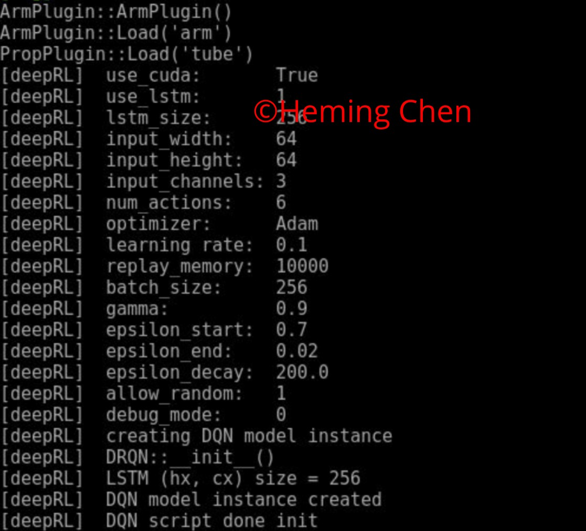

# Deep RL Arm Manipulation

## Introduction
RL emulates the process that human learns a skill - making an action and adjust next action based on feedback/reward from the world. The goal of this project is to teach robotic arm to touch an object (cylinder) using DQN.

Two objectives are specified for this project.
-1. Robot arm touches the object without the gripper touching the ground at greater than 90% accuracy for at least 100 attempts.
-2. Only the gripper is allow to touch the object without touching the ground with at least 80% accuracy for at least 100 attempts.

## Reward Functions
`ArmPlugin.cpp` contains the rewards and penalties used to train the Deep RL Arm DQN agent. 

More specifically, a reward of `+25` is given if:
- robot arm touches the cylinder in objective 1
- gripper touches the cylinder in objective 2

A penalty of `-25` is given if:
- robot touched the ground before completing its objective 
- robot is unable to complete the objective within 100 frames

An interim reward is given based on the position of the robot arm while moving, where the Smoothed Moving Average (SMMA) of the delta of the distance to the goal is used. 

As in defined in `ArmPlugin.cpp`:
- avgGoalDelta is the resulting reward function to determine if robot is moving closer to the object
- distDelta is (last distance to the goal – current distance to the goal)
- ALPHA is a constant between 0 and 1 to allow the most current delta to have a heavier weight than previous delta's.

The SMMA eventually helps reducing fluctuations and also assists the agent to maximize its rewards. The agent rewards are based on distance and position of the robot/gripper. Joint control is used to drive the robot arm. 

An overview of all parameters is given below.

## Hyperparameters
Careful selection of hyperparameters are the key to train a good DQN agent in terms of speed and accuracy in achieving the objectives. Hyperparameter tuning is more or less a trial and error process.

I first reduced the input size to 64x64 to speed up the processing. As mentioned in the course, a square image accelerates matrix operations and makes it run faster on GPU.

Adam optimizer run faster than RMSprop in converging hence was selected after a few tests. I also had good experience with Adam optimizer in other ML applications.

I then tested learning rate between `0.01` and `0.1` and `0.1` seemed good for both objectives.

Accordingly, `replay_memory` was set to `10000` to hold sufficient memory to help training.

LSTM with a `LSTM_SIZE` of `256` was used to keep track of both long and short term memory. It allowed the agent to use both past and present camera frames in training.

A screenshot of hyperparameters is given below.

## Results
Objective 1 was achieved with at least `90%` accuracy for a minimum of `100` runs with robot not touching the ground.

Objective 2 was achieved with the gripper touching the object without touching the ground at `>=80%` accuracy for a minimum of 100 runs.

## Conclusions and Future Work
The project is quite interesting and useful. Eventhough it is a greatly simplified problem (e.g. 2D as opposed to 3D, touching as opposed to picking up), the experience I acquired throughout the learning process was very valuable. If given more time, I would like do more hyperparameter tuning to achieve even better accuracy. I may also try a different implementation with Keras/Tensorflow, or even make the problem harder, e.g. touching two objects one after another.